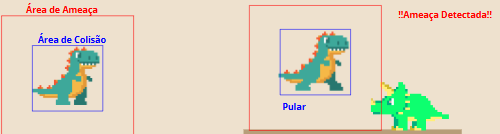
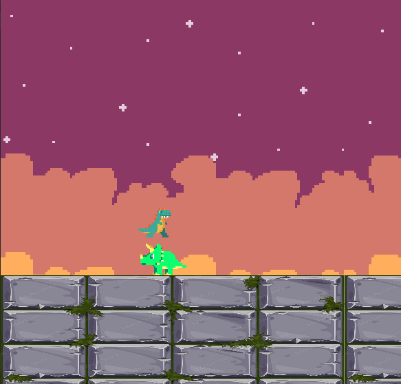
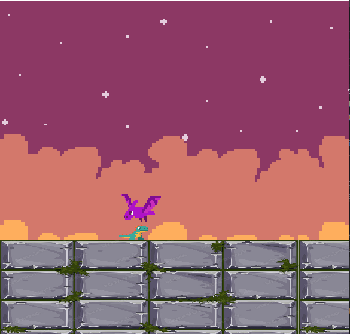
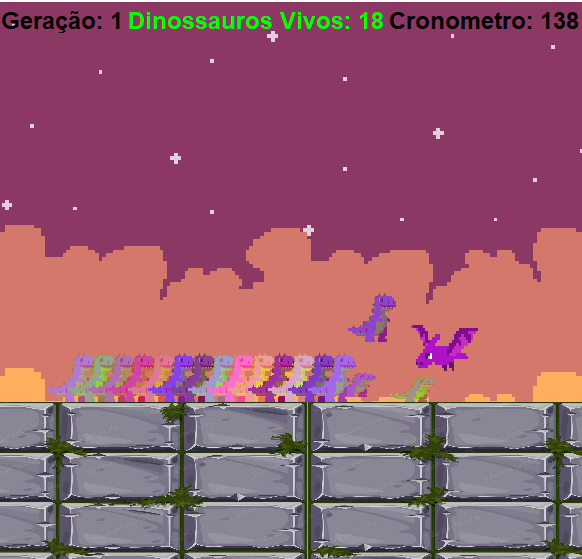

# 🦖 Dino AI
## Alrotimo Evolutivo e Rede Neural Evolutiva para o Jogo do Dinossauro do Chrome

Este projeto implementa uma **Inteligência Artificial Evolutiva** capaz de jogar um jogo inspirado no **Dinossauro do Google Chrome**.

O agente aprende exclusivamente por meio da interação com o ambiente, utilizando **Redes Neurais** otimizadas por **Algoritmos Evolutivos**, sem regras predefinidas ou comportamentos pré-programados.

> Os agentes sobrevivem, são avaliados pelo desempenho e evoluem ao longo das gerações.

---

## 🎯 Objetivo do Projeto

O objetivo principal é estudar e aplicar conceitos de **Computação Evolutiva** em um ambiente de jogo em tempo real, com foco em:

- Tomada de decisão usando **Redes Neurais**
- Aprendizado por **Algoritmos Evolutivos**
- Seleção baseada em **aptidão (fitness)**
- Uso de **elitismo**
- Adaptação comportamental a diferentes desafios

Os agentes aprendem sem dados rotulados, apenas por **interação, sobrevivência e desempenho**.

---

## 🧠 Como a IA Funciona

Cada dinossauro é controlado por sua própria **rede neural**, que recebe informações do estado do jogo e decide qual ação executar em tempo real.

### Entradas da Rede Neural

As entradas representam o estado atual do jogo:

- Posição do jogador `(X, Y)`
- Posição do inimigo `(X, Y)`
- Dimensões do inimigo (altura e largura)
- Velocidade do inimigo

Todas as entradas são **normalizadas** para manter escalas comparáveis.

---

### Saídas (Ações)

As ações são controladas diretamente pela rede neural:

- Pular
 

- Agachar
 

Não existe lógica fixa ou regras condicionais.

---

## 🧬 Aprendizado Evolutivo

O aprendizado ocorre por **evolução**, sem uso de backpropagation.

### 🔄 Ciclo de Geração

1. Inicialização da população
2. Todos os agentes jogam simultaneamente
3. Avaliação por função de aptidão
4. Remoção dos piores agentes
5. Preservação dos melhores por **elitismo**
6. Criação de novos agentes via **mutação** (e cruzamento opcional)
7. Repetição do processo por várias gerações

 

---

## 🏆 Função de Aptidão

A função de aptidão recompensa agentes que:

- Sobrevivem por mais tempo
- Evitam colisões
- Reagem corretamente a diferentes tipos de inimigos

São avaliados comportamentos contra:

- Inimigos terrestres
- Inimigos voadores

Isso evita estratégias repetitivas e estimula adaptação.

---

## ⚙️ Tecnologias Utilizadas

- Java
- Programação Orientada a Objetos (POO)
- Rede Neural implementada do zero
- Algoritmos Evolutivos
- Java Swing (renderização e loop do jogo)
- Simulação em tempo real

> Nenhuma biblioteca externa de IA ou Machine Learning foi utilizada.

---

## 🧪 Conceitos Aplicados

- Algoritmos Evolutivos
- Seleção baseada em aptidão
- Elitismo
- Mutação populacional e individual
- Redes Neurais Multicamadas
- Normalização de dados
- Sistemas de decisão em tempo real
- Avaliação por simulação

---

## 📊 Estado Atual

- ✅ IA evolutiva funcional
- ✅ Múltiplas gerações simuladas
- ✅ Inimigos dinâmicos e dificuldade crescente
- ✅ Monitoramento de fitness (mínimo, máximo e médio)
- 🚧 Ajustes contínuos de arquitetura e função de aptidão

---

## 📌 Importância do Projeto

Este projeto demonstra:

- Implementação prática de IA sem bibliotecas prontas
- Projeto de sistemas de aprendizado do zero
- Domínio de computação evolutiva
- Experiência com sistemas complexos
- Aplicação real de conceitos acadêmicos de IA

---

## 👤 Autor

**Guilherme Peres Mundim**  
Graduando em Sistemas de Informação  
Foco em Inteligência Artificial, Ciência de Dados e Engenharia de Software
